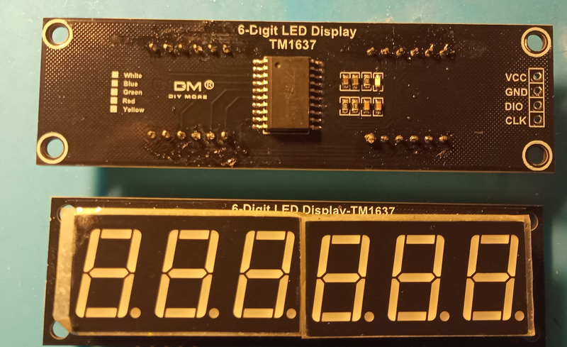
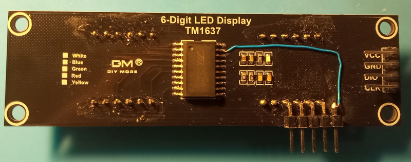
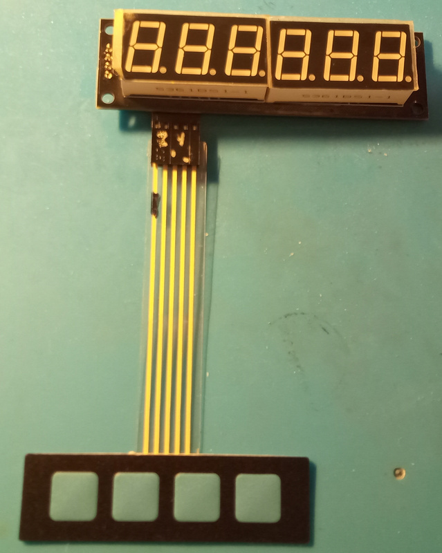
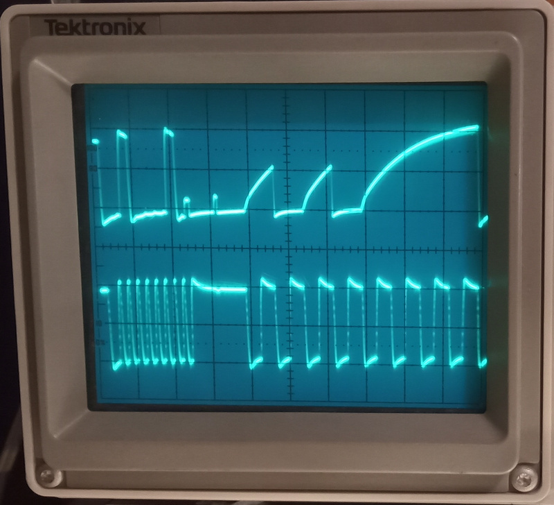
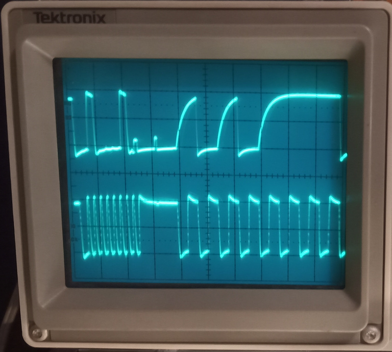

# TM1637

Library for TM1637 driven displays.

## Description

The TM1637 drives 7 segment displays

Library is tested with Arduino UNO and a 6 digits display.

ESP32 is supported since 0.2.0 see https://github.com/RobTillaart/TM1637_RT/pull/5

TO ELABORATE

## Interface

- **TM1637()** constructor
- **void init(uint8_t clockPin, uint8_t dataPin, uint8_t digits = 6)** set up the connection of the pins to the display.
As the display is only tested with a 6 digit display, this is used as the default of the digits parameter.
- **void displayRaw(uint8_t \* data, uint8_t pointPos)** low level write function.
- **void displayInt(long value)** idem
- **void displayFloat(float value)** idem
- **void displayHex(uint32_t value)** idem
- **void displayClear()** writes spaces to all positions, effectively clearing the display.
- **void setBrightness(uint8_t b)** brightness = 0 .. 7 default = 3.
- **uint8_t getBrightness()** returns value set.
- **uint8_t keyscan()** returns keyboard scanner state (see below).

### Tuning function

To tune the timing of writing bytes.

- **void    setBitDelay(uint8_t bitDelay = 10)**
- **uint8_t getBitDelay()**

### Tuning minimum pulse length

The class has a conditional code part in writeSync to guarantee the length of pulses
when the library is used with an ESP32. The function called there **nanoDelay(n)**
needs manual adjustment depending upon processor frequency and time needed for a digitalWrite.
Feel free to file an issue to get your processor supported.

### Keyboard Scanner usage and notes

Calling keyscan() returns a uint8_t, whose value is 0xff if no keys are being pressed at the time.  The TM1637 can only see one key press at a time, there is no "rollover".  If a key is pressed, then the values are as follows:

<TABLE>
<TR>
<TD colspan = 10>
   keyscan results are reversed left for right from the data sheet.
</TD>
</TR>
<TR>
<TD>pin</TD><TD>&nbsp</TD><TD>2</TD><TD>3</TD><TD>4</TD><TD>5</TD><TD>6</TD><TD>7</TD><TD>8</TD><TD>9</TD>
</TR>
<TR>
</TD><TD>&nbsp;</TD><TD>name</TD><TD>sg1</TD><TD>sg2</TD><TD>sg3</TD><TD>sg4</TD><TD>sg5</TD><TD>sg6</TD><TD>sg7</TD><TD>sg8
</TR>
<TR>
</TD><TD>19</TD><TD>k1</TD><TD>0xf7</TD><TD>0xf6</TD><TD>0xf5</TD><TD>0xf4</TD><TD>0xf3</TD><TD>0xf2</TD><TD>0xf1</TD><TD>0xf0
</TR>
<TR>
</TD><TD>20</TD><TD>k2</TD><TD>0xef</TD><TD>0xee</TD><TD>0xed</TD><TD>0xec</TD><TD>0xeb</TD><TD>0xea</TD><TD>0xe9</TD><TD>0xe8
</TR>
</TABLE>

To modify a "generic" TM1637 board for use with a keyboard, you must add connections to either or both of pins 19 and 20 (these are the "row" selects) and then to as many of pins 2 through 9 (the "columns") as needed.  Generic keyboards that are a 4x4 matrix won't work; the TM1637 can only scan a 2x8 matrix.  Of course, fewer keys are acceptable; I use a 1x4 keyboard in my projects.

Further, the TM1637 chip needs a fairly hefty pull-up on the DIO pin for the keyscan() routine to work.  There is no pull-up in the TM1637 itself, and the clone boards don't seem to have one either, despite the data sheet calling for 10K ohms pull-ups on DIO and CLOCK.  10K is to weak anyway.  I find that a 1K (1000) ohm resistor from DIO to 3.3 v works well.  This is perfect with a 3.3 volt processor like the ESP8266 or ESP32, and a 5V Atmega 328 ("Arduino UNO") family processor is happy with that as well.

The TM1637 boards want to be run off of 5 volts, regardless of what the processor voltage is.  Their logic levels are compatible with 3.3 volt processors, and they need 5 volts to make sure the LEDs light up.

 

The unmodified generic TM1637 board (front and back).  
 
The modified generic TM1637 board.  
 
The keyboard plugged into the TM1637 board.  
 
Scope photo showing slow rise time of DIO pin (upper trace) on the unmodified TM637.  
 
Scope photo showing faster rise time of DIO pin (upper trace) with 1000 ohm pull-up on DIO.  

## Operation

See examples

## Future

- elaborate documentation
- testing
- rename **init()** to **begin()** ?
- 
